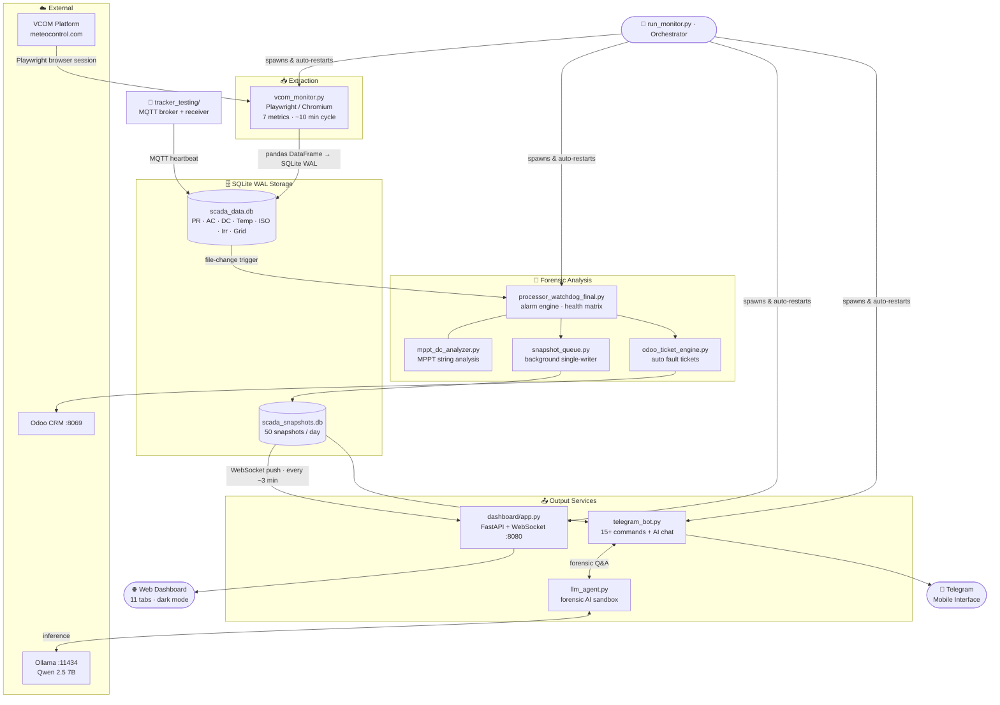

# 🌞 Mazara VCOM Automation — AI-Powered SCADA Monitoring Pipeline

[](https://python.org)
[](https://ollama.com)
[](#)
[](#)
[](#)

A complete, production-hardened automated monitoring pipeline for a **12.625 MWp** utility-scale solar plant (Mazara del Vallo, Sicily). The system integrates a **local LLM (Qwen 2.5 via Ollama)** for forensic diagnostics, scrapes real-time telemetry from VCOM (meteocontrol.com) every ~10 minutes via Playwright browser automation, stores everything in a SQLite WAL database, and serves a reactive WebSocket-driven dark-mode dashboard with 11 data tabs — plus a full Telegram bot with AI chat capability.

> [!TIP]
> **AI-Search Ready:** This repository is optimized for LLM indexing (see [llms.txt](./llms.txt)).

**System Status:** ✅ Active Forensic Analysis | ✅ Local AI Agent (Qwen 2.5 7B via Ollama) | ✅ Concurrent Telegram Bot | ✅ Production-Stable Orchestrator | ✅ Odoo Ticket Integration | ✅ Solar Tracker Monitoring

---

## 🚀 Key Improvements (July 2026 Update)

### Data Quality Tab ("Qualità Dati")
- New dashboard tab showing a **36-inverter × 7-metric coverage matrix** with per-cell colour coding: green (data present), red (missing), grey (night/no history).
- Summary cards per metric show how many inverters have complete data for the day.
- Extraction file status row shows the last successful pull time and age for each source.
- `buildDataCoverage()` in `app.js` classifies each cell by checking `inverter_health` snapshot fields.

### AI Per-Inverter and Per-Transformer PR
- `get_pr_data()` in `llm_agent.py` now handles the **long-format PR table** (`PR inverter | PR inverter [%]` columns): groups by inverter, computes individual averages, then aggregates per transformer.
- `ai_system_prompt.txt` now contains explicit PR data rules preventing the LLM from reporting `plant_avg_pr` as a per-TX value.
- The AI correctly answers "PR di TX3" → `by_transformer["TX3"]`, not the plant average.

### MPPT DC Dot Fix
- All 432 MPPT LED indicators (12 per inverter × 36 inverters) were rendering grey due to an off-by-one bounds check after the daylight filter.
- Root cause: `fleet_ref_idx` held a pandas label from the unfiltered index (0–750); after slicing to daylight rows (361 entries with labels 378–750) the check `750 < 361` was False, skipping `.iloc` for every MPPT.
- Fix: `.reset_index(drop=True)` after the daylight filter in `mppt_dc_analyzer.py` so `fleet_ref_idx` aligns with the new 0-based positional index.

### ACT Column in Data Quality Tab
- `compute_latest_health()` was missing `"Regolazione della potenza attiva"` from its `priority_names` list (only the curtailment check block had it), so `act_val` always resolved to `None` — all 36 ACT cells stayed red.
- Fixed by syncing both `priority_names` lists.

### POA Night Display
- Irradiance sensor returns `−1` at night; `if poa:` treated it as truthy, so Telegram `/status`, `/plant`, `/weather`, and `/daily` showed "−1 W/m²".
- Fixed to `if poa and poa > 0:` in all four message builders.

### Snapshot Queue Reliability
- `snapshot_queue.py` was missing `import random`; the retry back-off (`random.random()`) raised `NameError` on every failed DB write, causing all snapshots to fall through to the JSON fallback while the old DB row served stale data to the dashboard.

### Startup Grace Period for AC Trip Alarms
- AC trip ("INVERTER SCATTATO") alarms were firing during the 30-minute plant warm-up window when inverters are still ramping and AC output is legitimately zero.
- Watchdog now gates AC trip alarms on `is_stabilized` (same as PR alarms).

---

## 🚀 Key Improvements (June 2026 Update)

### Grid Curtailment Intelligence
- **PR Alarm Suppression:** Low PR alarms are now automatically silenced when the plant is under grid limit curtailment (grid limit < 87%). This prevents alarm storms during forced curtailment events that are outside the plant's control.
- **Curtailment Visibility:** The `/status`, `/pr`, and `/plant` Telegram commands now surface the active grid limit percentage with a prominent warning when curtailment is below the nominal 87.6%.

### New `/plant` Telegram Command
Provides a concise plant-health summary in a single message: energy produced today, online inverters, POA irradiance, average PR, grid limit status, and up to 3 active alarms.

### Data Pipeline Bug Fixes
- **DB write reliability:** `conn.commit()` in `db_manager.py` was incorrectly placed inside the chunk-write loop, causing one commit per chunk. Moved outside the loop — a single commit now covers the entire batch, reducing WAL churn and eliminating partial-write risk.
- **Empty-DataFrame guard:** `base_monitor.export_metric()` now detects and skips DataFrames that contain only time/metadata columns (no actual inverter data), preventing empty tables from being written to the database.

### AI Formatting Instructions
`ai_system_prompt.txt` now includes explicit Telegram formatting guidelines: use of Markdown (bold, italic), structured emojis per metric type, and mandatory curtailment highlighting in status/PR responses.

### Diagnostic Utility Scripts
- **`check_log_error.py`** — scans `monitoring.log` for CRITICAL/FATAL/Exception entries.
- **`check_watchdog_overnight.py`** — inspects `logs/watchdog.log` for a specified overnight window.

---

## 🚀 Key Improvements (April 2026 Update)

Seamlessly integrates **Qwen 3.5 9B** via local Ollama (localhost) for plant diagnostics:
- **Deep CSV Correlation:** Automatically scans historic CSVs to verify startup behavior (e.g., "Early Hours" production checks).
- **Hardened Data Loading:** Custom `load_csv` helper with auto-column stripping and encoding detection (UTF-8/Latin-1) to handle SCADA formatting quirks.
- **Data Collision Shield:** Built-in retries and historical fallbacks to prevent crashes during concurrent file writes by the Watchdog.

### 📱 Multi-User Telegram Bot (`telegram_bot.py`)
- **Concurrency:** Fully multi-threaded; handles dozens of simultaneous AI requests without freezing.
- **Quick Shortcuts:** Instant commands like `/alerts`, `/daily`, `/status`, and `/plant`.
- **Instant Feedback:** Immediate "⏳ Thinking..." status while the local GPU processes complex logic.
- **Group Chat Support:** Bot username suffix (`@BotName`) stripped from commands automatically so group-chat commands work correctly.

- **Stable Reliability:** Hot-reload is controlled (semi-automated) to prevent excessive restarts during long extraction cycles, ensuring the browser session remains stable.

---

## 🎯 Quick Start

### Prerequisites
- **Python 3.9+** (tested on 3.10, 3.11, 3.12, 3.14)
- **Windows** (native batch scripting; Linux/macOS may require path adjustments)
- **Network access** to meteocontrol.com and a writable network share (or local `extracted_data/`)

### Installation

```bash
# Clone the repository
git clone https://github.com/MuhammadAbbasi/VCOM-Automation.git
cd VCOM-Automation

# Install dependencies
pip install -r requirements.txt

# Install Playwright browsers
playwright install chromium

# Setup Configuration
cp config.json.example config.json
cp user_settings.json.example user_settings.json
# Edit config.json and user_settings.json with your credentials and preferences
```

---

## 🐳 Docker Deployment (Recommended for Production)

The recommended way to run the full stack is Docker Compose. All services (dashboard, extraction, watchdog, telegram, tickets, broker, tracker, Cloudflare tunnel) are containerized and managed together.

### Prerequisites

- [Docker Desktop](https://www.docker.com/products/docker-desktop/) installed and running
- Git

### First-Time Setup on a New PC

**1. Clone the repository**
```bash
git clone https://github.com/MuhammadAbbasi/VCOM-Automation.git
cd "VCOM Automation"
```

**2. Create the `.env` file**

Copy the template and fill in your credentials:
```
VCOM Automation Docker/.env
```

Required variables:
```env
VCOM_USERNAME=your_vcom_username
VCOM_PASSWORD=your_vcom_password
VCOM_SYSTEM_URL=https://vcom.meteocontrol.com/vcom/evaluation/index/index/systemId/YOUR_SYSTEM_ID
INVERTER_IDS_JSON=[...]
DASHBOARD_USER=your_dashboard_user
DASHBOARD_PASS=your_dashboard_password
TELEGRAM_BOT_TOKEN=...
TELEGRAM_CHAT_ID=...
TELEGRAM_PERSONAL_ID=...
ODOO_URL=http://host.docker.internal:8069
ODOO_DB=odoo
ODOO_USER=...
ODOO_PASS=...
CLOUDFLARE_TUNNEL_TOKEN=...
TZ=Europe/Rome
```

**3. Migrate the database (preserves all historical data)**

Run the migration script **before** the first `docker compose up`:

```bash
# Migrate databases only (recommended first time)
python db_migrate_to_docker.py

# Or with full backup history (~11 GB extra)
python db_migrate_to_docker.py --with-backups
```

What the script does:
- Checkpoints WAL journals to prevent data loss
- Runs `VACUUM INTO` on each database (compresses + defragments)
- Verifies integrity of each database
- Creates the `scada_db_data` Docker volume
- Copies all databases and JSON state files into the volume
- Prints a before/after size summary

**4. Build and start the stack**

```bash
cd "VCOM Automation Docker"
docker compose up --build -d
```

**5. Verify everything is running**

```bash
docker compose ps
docker compose logs -f dashboard
```

Dashboard will be live at:
- **Local:** `http://localhost:8080`
- **Remote:** `https://getdashboard.dpdns.org` (via Cloudflare Tunnel)

---

### Transferring to a New PC (Full Data Migration)

Follow these steps to move the entire system with all historical data:

**On the old PC:**

```bash
# 1. Stop the running stack
cd "VCOM Automation Docker"
docker compose down

# 2. Export the database volume to a tar archive
docker run --rm \
  -v scada_db_data:/data \
  -v "$(pwd)":/backup \
  python:3.12-slim-bookworm \
  tar czf /backup/scada_db_data_backup.tar.gz -C /data .

# 3. Copy these files/folders to the new PC:
#    - scada_db_data_backup.tar.gz  (database volume export)
#    - VCOM Automation Docker/.env  (credentials — keep secure)
#    - db/backups/                  (optional: 11 GB backup history)
```

**On the new PC:**

```bash
# 1. Install Docker Desktop, then clone the repo
git clone https://github.com/MuhammadAbbasi/VCOM-Automation.git
cd "VCOM Automation"

# 2. Restore .env
#    Copy your .env to: VCOM Automation Docker/.env

# 3. Create volume and restore data
docker volume create scada_db_data
docker run --rm \
  -v scada_db_data:/data \
  -v "$(pwd)":/backup \
  python:3.12-slim-bookworm \
  tar xzf /backup/scada_db_data_backup.tar.gz -C /data

# 4. Build and start
cd "VCOM Automation Docker"
docker compose up --build -d
```

> **Windows PowerShell note:** Replace `$(pwd)` with `${PWD}` in the commands above.

---

### Managing the Running Stack

```bash
# View all container statuses
docker compose ps

# Follow logs for all services
docker compose logs -f

# Follow logs for a specific service
docker compose logs -f dashboard
docker compose logs -f extraction
docker compose logs -f cloudflared

# Restart a single service without rebuilding
docker compose restart watchdog

# Stop everything
docker compose down

# Rebuild and restart after code changes
docker compose up --build -d
```

### Updating the Application

```bash
git pull
cd "VCOM Automation Docker"
docker compose up --build -d
```

---

### 📦 Legacy Migration Guide (Local Python, no Docker)
1. **Copy Files**: Transfer the entire project folder to the new system.
2. **Environment**: Re-run the installation steps above.
3. **Data Preservation**: Copy the `db/` folder and `extracted_data/` folder to the new system.
4. **Hardware**: Ensure the new system has at least 8GB RAM and stable network access for the browser automation.

### Run the System

```bash
# Start all three services (extraction, analysis, dashboard)
python run_monitor.py
```

Then open your browser:
```
http://localhost:8080
```

---

## 📋 What This Does

### 1. **Extraction Pipeline** (`vcom_monitor.py`)
Logs into VCOM every ~10 minutes and scrapes **7 metrics** via Playwright:

| Metric | Table | Format |
|--------|-------|--------|
| Performance Ratio (PR) | `pr_readings` | Long (inverter × value rows) |
| AC Power | `potenza_ac` | Wide (1 col per inverter) |
| DC Current | `corrente_dc` | Long (normalized) |
| Temperature | `temperatura` | Wide |
| Insulation Resistance | `resistenza_isolamento` | Wide |
| Irradiance (POA) | `irraggiamento` | Wide |
| Grid Active Power Limit | `potenza_attiva` | Wide (time series) |

**Universal Login & Session Shield:** Handles both legacy VCOM and modern Keycloak SSO flows. Automated session-expiry detection and Bootstrap modal auto-dismissal prevent extraction stalls.

**Schema Auto-Migration:** When VCOM adds new columns (e.g., `"Regolazione della potenza attiva [%]"`), `db_manager.py` issues `ALTER TABLE ADD COLUMN` automatically rather than failing the write.

### 2. **Forensic Analysis** (`processor_watchdog_final.py`)
- Triggers on every new DB write via file-change detection; also runs on a 3-minute fallback timer.
- Scans for **7 anomaly types**: Low PR, High Temperature, DC String Loss, Comms Loss, Inverter Trip, Grid Curtailment, MPPT Mismatch.
- **Startup grace period (30 min):** PR and AC alarms are suppressed during plant ramp-up to prevent false positives.
- **Grid curtailment suppression:** Low PR alarms silenced when grid limit < 87 % to avoid alarm storms during forced curtailment.
- **Dynamic daylight:** Production start/end detected from actual AC data rather than fixed sun-times.
- **MPPT analysis** (`mppt_dc_analyzer.py`): fleet-median-based expected-current comparison, time-aligned via `fleet_ref_idx`, identifies single-string faults vs. design exceptions.

### 3. **Live Dashboard** (`dashboard/static/`) — 11 Tabs

| Tab | Content |
|-----|---------|
| Panoramica | Plant overview: power, energy, PR, inverter health matrix |
| Mappa Impianto | Visual plant map with TX/inverter layout |
| Dettaglio PR | Per-inverter and per-transformer PR breakdown |
| Temperatura | Inverter temperature heatmap |
| Corrente DC | MPPT-level current LEDs (432 dots: 12 × 36 inverters) |
| Potenza AC | AC power per inverter |
| Sensori | Irradiance and environmental sensor history |
| Analisi | Downtime tracker and forensic event log |
| Campo Tracker | Solar tracker NCU/TCU status and angle monitoring |
| Qualità Dati | **36 × 7 data coverage matrix** — per-cell colour: green/red/grey |
| Chat AI | In-browser AI diagnostics chat (Qwen 2.5 via Ollama) |

**Data Push:** FastAPI **WebSockets** stream real-time JSON every ~3 minutes without page reloads.

### 4. **Telegram Bot** (`telegram_bot.py`)
Full-featured SCADA assistant over Telegram with 15+ commands and free-text AI chat:

```
/status    — live power, energy, PR, alarm summary
/plant     — compact plant state (energy, online count, grid limit)
/pr        — PR by transformer (TX1/TX2/TX3)
/pr_inverter — PR for all 36 inverters
/inverters — 36-inverter health matrix
/inverter TX1-03 — single inverter deep-dive
/alerts    — active anomalies
/daily     — today's energy summary
/week      — 7-day production history
/energy    — 30-day / yearly totals
/compare   — TX1 vs TX2 vs TX3 production
/weather   — POA irradiance + temperatures
/peak      — today's peak power and time
/uptime    — plant availability percentage
/generate_ticket — create Odoo fault ticket interactively
```

Any free-text message routes to the local LLM for forensic Q&A.

### 5. **Local LLM** (`llm_agent.py`)
- Model: **Qwen 2.5 7B** via Ollama at `localhost:11434` (runs fully offline)
- Pre-computed snapshot injected into context: PR by transformer, active anomalies, MPPT details, tracker summary
- Safe code execution sandbox: LLM can write Python code blocks that are executed against live DB functions (`query_db`, `load_metric`, `get_dc_currents`, etc.)
- `num_ctx=8192`, `temperature=0.1` for deterministic diagnostic output

### 6. **Odoo Ticket Engine** (`odoo_ticket_engine.py`)
Auto-creates fault tickets in the local Odoo instance (localhost:8069) from watchdog alarms:
- Alarm types: INVERTER TRIP, LOW PR, CRIT PR, ISO FAULT, COMM LOST, DC MPPT FAULT, HIGH TEMP, CRIT TEMP, TRACKER OFFLINE, GRID LIMIT CHANGE, PLANT OUTAGE
- Deduplicates tickets (configurable suppression window per fault type)
- Links Odoo `anomalia` records to `intervento` work orders automatically

---

## 🏗️ Architecture

```
VCOM Automation/
├── run_monitor.py                     ← Orchestrator (launches all services)
├── vcom_monitor.py                    ← Extraction loop (~10-min cycle)
├── extraction_code/                   ← 7 metric scrapers (sync-Playwright)
│   ├── base_monitor.py                ← Shared login, nav, VCOM session helpers
│   ├── pr_monitor.py
│   ├── potenza_ac_monitor.py
│   ├── corrente_dc_monitor.py
│   ├── resistenza_monitor.py
│   ├── temperatura_monitor.py
│   ├── irraggiamento_monitor.py
│   └── potenza_attiva_monitor.py      ← Grid limit / active power curtailment
├── processor_watchdog_final.py        ← Forensic analyzer + alarm engine
├── mppt_dc_analyzer.py                ← Per-MPPT string-level current analysis
├── llm_agent.py                       ← Local LLM (Qwen 2.5 via Ollama)
├── ai_system_prompt.txt               ← Plant topology + LLM reasoning rules
├── telegram_bot.py                    ← Multi-command Telegram bot + AI chat
├── odoo_ticket_engine.py              ← Auto fault-ticket creation in Odoo
├── tracker_testing/
│   ├── broker.py                      ← MQTT broker for tracker NCU messages
│   └── receiver.py                    ← Tracker data → SQLite + link heartbeat
├── dashboard/
│   ├── app.py                         ← FastAPI + WebSocket broadcast server
│   └── static/
│       ├── index.html                 ← 11-tab dark-mode dashboard
│       ├── app.js                     ← WebSocket client + all tab renderers
│       └── style.css                  ← Glassmorphism UI, pulse animations
├── db/
│   ├── db_manager.py                  ← All SQLite I/O, WAL connections, migration
│   ├── snapshot_queue.py              ← Background single-writer snapshot queue
│   ├── scada_data.db                  ← All metric tables (wide + long format)
│   └── scada_snapshots.db             ← Analysis snapshots (JSON blobs, 50/day)
├── dashboard_doctor.py                ← Hourly DB health check + auto-backup
└── requirements.txt
```

**System Flowchart:**



---

## ⚙️ Configuration

### `.env` File (REQUIRED)

```env
# VCOM Credentials
VCOM_USER=your_username
VCOM_PASS=your_password
VCOM_SYSTEM_ID=YOUR_SYSTEM_ID

# Optional: Custom URLs (defaults to production VCOM)
VCOM_URL=https://vcom.meteocontrol.com/vcom/
DASHBOARD_PORT=8080
```

**Security Note:** `.env` is in `.gitignore` — never commit credentials.

### Health Thresholds (`processor_watchdog_final.py`)

Adjust these constants to tune alerting:

```python
# Line ~58 in processor_watchdog_final.py
PR_THRESHOLD = 85.0           # % (normalize to 0-100)
TEMP_CRITICAL = 45.0          # °C
TEMP_WARNING = 40.0           # °C
AC_HEALTHY_MIN = 5000         # W (during daylight)
DAYLIGHT_START = 7.0          # hours (07:00)
DAYLIGHT_END = 19.0           # hours (19:00)
```

### Time-Aware DC Thresholds

DC current expectations vary by time of day:
- **Morning (07:00-12:00):** Green ≥10A, Yellow ≥2A
- **Afternoon (12:00-19:00):** Green ≥5A, Yellow ≥0.5A
- **Off-hours:** Grey (no generation expected)

This prevents false alerts for normal late-afternoon power decline.

---

## 📊 Dashboard Colors & Meanings

### LED Status (PR, Temp, DC, AC)
- 🟢 **Green** — Healthy (all metrics within thresholds)
- 🟡 **Yellow** — Warning / Sub-optimal (e.g., thermal warning or slight DC deviation)
- 🔴 **Red** — Critical (e.g., inverter tripped or severe low PR)
- ⚪ **Slate Grey** — Communications Lost (Distinguished from warnings)
- ⚫ **Dark Grey** — Off-hours / No data

### Thresholds (Customizable via Dashboard Settings UI)
- **PR:** 🟢&ge;x% | 🟡&ge;y% | 🔴<y% (*active after 30m stabilization, handled dynamically*)
- **Temperature:** 🟢&le;x°C | 🟡&le;y°C | 🔴>y°C
- **AC Power:** Evaluated relatively: 🟢>95% Plant Avg | 🔴<95% Plant Avg. Exceptions granted for low-POA conditions (<50 W/m²).
- **DC Current:** Deep string deviations detected dynamically by checking internal MPPTs and domain-levels.

---

## 📈 Forensic Rules

The watchdog applies deep diagnostic rules in priority order:

| Rule | Condition | Severity |
|------|-----------|----------|
| **Low PR** | PR < thresholds after 30m stabilization period; **suppressed if grid limit < 87%** | 🔴 Critical |
| **High Temp** | Temperature > configured limit | 🔴 Critical |
| **DC String Loss** | String fault/open circuit/underperformance detected via dynamic MPPT comparison | 🔴/🟡 Fault/Warning |
| **Comms Loss** | Data missing (x) for entire component | 🟡 Warning |
| **Inverter Trip / AC Power Loss** | AC output deviates >5% below the plant average during nominal POA | 🔴 Critical |
| **Grid Curtailment** | Grid limit < 87% — surfaced in status/PR messages; suppresses Low PR alarms | ⚠️ Info |

Historical alarms feature a category drop-down filter, and consecutive alerts on the same inverter/rule are deduplicated dynamically.

---

## 🔧 Usage & Troubleshooting

### Starting the System

```bash
python run_monitor.py
```

**Output:**
```
============================================================
   [ORCHESTRATOR] Mazara SCADA Monitor System Control
============================================================
[*] Root Directory: \\S01\get\...\VCOM Automation
[*] Launching WATCHDOG (Forensic Analysis)...
[*] Launching EXTRACTION (VCOM Browser Automation)...
[*] DASHBOARD must be run separately: 'python dashboard/app.py'
------------------------------------------------------------
[ORCHESTRATOR] Started WATCHDOG (pid=12345)
[ORCHESTRATOR] Started EXTRACTION (pid=12346)
```

### Logs

Check real-time logs:
```bash
# Extraction logs (browser automation)
tail -f monitoring.log

# Watchdog logs (analysis)
tail -f watchdog.log

# Dashboard logs (FastAPI)
# (outputs to console)
```

### Common Issues

**Issue:** Browser doesn't open VCOM login page
- **Fix:** Check network connectivity. Verify `VCOM_URL` in `.env` is reachable.

**Issue:** "Valori minimi non disponibili" popup blocks extraction
- **Fix:** This is normal — the code automatically dismisses it. Wait 2-3 seconds for data to load.

**Issue:** Dashboard shows all grey LEDs
- **Fix:** Normal during off-hours (19:00-07:00). Check that `extracted_data/` contains today's Excel files.

**Issue:** Memory usage grows over time
- **Fix:** Logs and old JSON files accumulate. Manually clean `extracted_data/` files older than 7 days.

**Issue:** Port 8080 already in use
- **Fix:** Change `DASHBOARD_PORT=8080` in `.env` or kill the process: `lsof -ti :8080 | xargs kill -9`

---

## 📚 Documentation

| File | Purpose |
|------|---------|
| `docs/ANALYSIS_FIX_SUMMARY.md` | Problem/solution analysis, thresholds, and migration guide |
| `docs/DATA_STRUCTURE_AND_ANALYSIS.md` | Comprehensive data format docs for all 6 metrics |
| `docs/analysis_method.md` | Forensic rule definitions and implementation details |
| `docs/SYSTEM_PROMPT.md` | Plant topology (36 inverters, 14 sensors, string mapping) |
| `docs/PLANT_MAP_IMPLEMENTATION.md` | Plant visual map component design |
| `docs/LOGIN_UPDATE_SUMMARY.md` | VCOM Keycloak login flow changes and handling |
| `docs/FUTURE_WORKS.md` | Planned and possible future improvements |
| `README.md` | This file |

---

## 🚀 Performance & Optimization

### Extraction Cycle
- **Duration:** ~2-5 minutes per 10-minute cycle
- **Data Format:** Excel (openpyxl append mode)
- **CSV Conversion:** Automatic (Excel→CSV for faster analysis)

### Analysis
- **Memory:** ~200-400 MB (no massive merges)
- **Duration:** <5 seconds per analysis run
- **Method:** Potenza_AC master + on-demand metric lookups

### Dashboard
- **Communication Channel:** Persistent FastAPI WebSocket
- **Response Time:** Real-time push logic immediately on payload build
- **Supported Browsers:** Chrome, Firefox, Safari, Edge (dark mode compatible)

---

## 🔐 Security

- **Credentials:** Stored in `.env` (git-ignored)
- **Sensitive Data:** Excel/CSV files stored in `extracted_data/` (git-ignored)
- **Dashboard:** Local-only (port 8080, no auth required — use firewall rules for production)
- **Browser Automation:** Headless Chromium, screenshots saved to `errors/` on failure

**For production deployment:**
1. Use HTTPS reverse proxy (nginx, Apache)
2. Add authentication (e.g., Basic Auth, OAuth)
3. Restrict network access to internal subnets
4. Implement log rotation and archival

---

## 📋 Plant Topology (Mazara del Vallo)

- **System ID:** YOUR_SYSTEM_ID
- **Inverters:** 36 total (TX1-01 through TX3-12)
- **Topology:** 3 transformers (TX1, TX2, TX3), 12 inverters each
- **DC Strings:** 12 MPPT channels per inverter
- **Environmental Sensors:** 14 (irradiance, temperature, etc.)
- **Excluded Devices:** SunGrow SG350HX (filtered in extraction)

---

## 🛠️ Development & Contributing

### File Versions
| File | Status | Use Case |
|------|--------|----------|
| `processor_watchdog_final.py` | ✅ ACTIVE | Production analyzer |
| `processor_watchdog.py` | ⚠️ Deprecated | Legacy reference |
| `processor_watchdog_v2/v3.py` | ❌ Archived | Old attempts, do not use |

### Adding a New Metric

1. Create `extraction_code/new_metric_monitor.py`
2. Import `base_monitor` helpers
3. Implement `extract_new_metric(page) -> pd.DataFrame`
4. Add to `METRICS` list in `vcom_monitor.py`
5. Update watchdog rules in `processor_watchdog_final.py`

### Testing Locally

```bash
# Test extraction (single cycle)
python vcom_monitor.py

# Test analysis (on existing data)
python processor_watchdog_final.py

# Test dashboard (standalone)
cd dashboard && python app.py
```

---

## 📞 Support & Issues

- **Reference Implementation:** https://github.com/MuhammadAbbasi/SCADA_monitoring_automation
- **VCOM Platform:** https://vcom.meteocontrol.com
- **Playwright Docs:** https://playwright.dev/python/

For bugs, feature requests, or questions, open an issue on GitHub.

---

## 📄 License

This project is provided as-is. Adapt and use freely, but ensure compliance with VCOM's terms of service and local regulations for SCADA monitoring.

---

**Last Updated:** 2026-07-09
**System Status:** ✅ Production-hardened — SQLite WAL pipeline, grid curtailment intelligence, Docker stack, Telegram bot with AI chat (Qwen 2.5 7B), Odoo ticket integration, solar tracker monitoring, 11-tab dashboard with data-quality matrix.
